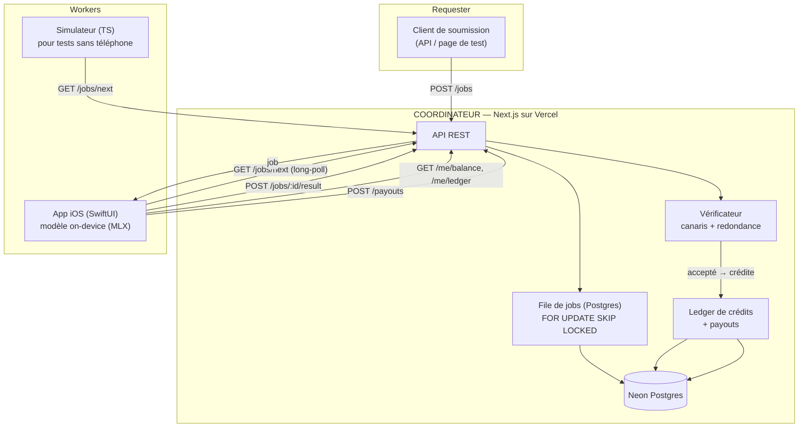

# 02 — Architecture · NVP Node v0

## Principe

v0 = sous-ensemble **« dispatch de jobs »** du protocole NVP complet. On garde la séparation control plane / data plane conceptuelle, mais comme chaque worker exécute un **modèle entier** (pas un bloc de couches), il n’y a pas de flux d’activations entre nœuds : un job = {prompt, params} entre, une complétion sort. Le pipeline d’activations (NVP-D) est reporté en v2.

Mapping avec la spec NVP complète :

|Concept NVP complet      |Équivalent v0                             |
|-------------------------|------------------------------------------|
|Dispatcher / DHT         |Coordinateur central (table `jobs`)       |
|Settlement Layer         |Ledger Postgres + table `payouts`         |
|Registry (stake/réput)   |Champ `reputation` sur `workers` + canaris|
|Worker (bloc de couches) |Worker (modèle entier)                    |
|NVP-D (activations, QUIC)|**reporté v2**                            |

## Schéma système



## Cycle de vie d’un job

```mermaid
sequenceDiagram
    participant A as App iOS (worker)
    participant C as Coordinateur
    participant D as Postgres

    A->>C: POST /workers/register (clé publique appareil)
    C->>D: insert worker + api_key (hashée)
    C-->>A: worker_id + api_key

    A->>C: GET /models  (que dois-je télécharger ?)
    C-->>A: liste modèles supportés + URLs

    loop mode worker actif
        A->>C: GET /jobs/next?models=qwen0_5b (long-poll)
        C->>D: SELECT ... FOR UPDATE SKIP LOCKED → assign
        C-->>A: job {id, prompt, params(greedy)}
        A->>A: inférence on-device (temperature=0)
        A->>C: POST /jobs/:id/result {output, latency_ms}
        C->>C: vérifie (canari ? redondance ?)
        alt accepté
            C->>D: ledger += credit_rate ; job=done
            C-->>A: {accepted:true, credited:X, balance:Y}
        else rejeté
            C->>D: job=failed ; reputation--
            C-->>A: {accepted:false}
        end
    end
```

## Vérification (design)

But : empêcher un worker de renvoyer des réponses bidon pour toucher des crédits, **sans** tout recalculer côté serveur.

Trois mécanismes combinés, du plus léger au plus coûteux :

1. **Jobs-canaris (toujours actifs).** Une fraction `p_canary` (ex. 10 %) des jobs servis sont des canaris : leur **réponse attendue est connue** côté serveur (stockée dans `jobs.canary_expected`), mais le worker ne sait pas que c’en est un. À la soumission, on compare la sortie à l’attendu (égalité exacte, car greedy). Mauvaise réponse → **rejet + réputation en baisse**. Bonne réponse → on a une preuve fraîche que ce worker calcule vraiment.
- Les canaris se génèrent en faisant tourner le modèle de référence (greedy) sur un set de prompts → on stocke (prompt, sortie attendue).
1. **Redondance échantillonnée (optionnelle).** Pour une fraction `p_redundant` des **vrais** jobs, on envoie le **même** job à 2 workers et on compare. Égalité (greedy) → on crédite les deux et on confirme leur fiabilité. Désaccord → on déclenche un 3ᵉ worker (arbitre) ; le minoritaire perd de la réputation.
1. **Réputation + gating.** Chaque worker a un score. Sous un seuil → suspendu. Au-dessus → peut recevoir moins de canaris (moins de surcoût). Anti-sybil v0 = clé d’API + rate-limit ; v1 = **App Attest**.

> Greedy obligatoire : sans `temperature=0`, deux sorties correctes peuvent différer et la comparaison casse. Toute la vérif v0 repose là-dessus.

## Délivrance des jobs : long-polling

v0 = `GET /jobs/next` qui **attend jusqu’à ~25 s** qu’un job se présente avant de répondre 204. Simple, sans websocket, suffisant. Migration SSE/WebSocket en v1 si besoin de débit.

## Déploiement

- Coordinateur : Vercel (API routes) + Neon (Postgres serverless). Migrations Drizzle au déploiement.
- Modèles : hébergés en object storage public (ou repo HF) ; le coordinateur ne sert que des **URLs**, pas les poids.
- Secrets : `DATABASE_URL`, `ADMIN_TOKEN` (pour seed/payouts) en variables d’env Vercel.