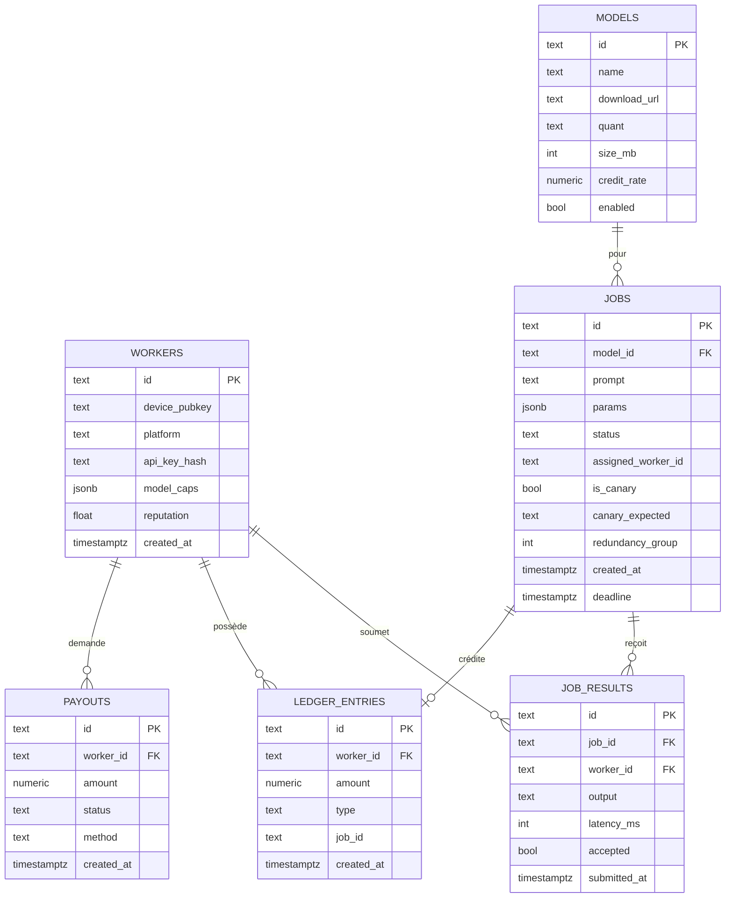

# 03 — API & modèle de données · NVP Node v0

Toutes les réponses en JSON. Auth worker : header `Authorization: Bearer <api_key>`.
Auth admin (seed, payouts) : header `X-Admin-Token: <ADMIN_TOKEN>`.

## Endpoints

|Méthode|Chemin                  |Auth      |Rôle                                                             |
|-------|------------------------|----------|-----------------------------------------------------------------|
|POST   |`/api/workers/register` |—         |Enregistre un appareil, renvoie `worker_id` + `api_key`          |
|GET    |`/api/models`           |worker    |Liste des modèles supportés + URLs de téléchargement             |
|GET    |`/api/jobs/next`        |worker    |Long-poll : réclame un job pour les modèles que le worker possède|
|POST   |`/api/jobs/:id/result`  |worker    |Soumet le résultat d’un job                                      |
|GET    |`/api/me/balance`       |worker    |Solde de crédits courant                                         |
|GET    |`/api/me/ledger`        |worker    |Historique des écritures de crédit                               |
|POST   |`/api/payouts`          |worker    |Demande de retrait                                               |
|GET    |`/api/me/payouts`       |worker    |Liste de ses demandes de retrait                                 |
|POST   |`/api/jobs`             |requester*|Soumet un job d’inférence                                        |
|POST   |`/api/admin/models`     |admin     |Ajoute un modèle supporté                                        |
|POST   |`/api/admin/canaries`   |admin     |Seed de jobs-canaris                                             |
|POST   |`/api/admin/payouts/:id`|admin     |Approuve/rejette un retrait                                      |

* en v0 le requester peut réutiliser un token admin/simple pour simplifier.

## Exemples

### POST /api/workers/register

```json
// req
{ "device_pubkey": "ed25519:9f3a…", "platform": "ios", "model_caps": ["qwen2_5_0_5b"] }
// res
{ "worker_id": "wk_7Ka2", "api_key": "nvp_live_8f…", "reputation": 1.0 }
```

### GET /api/jobs/next?models=qwen2_5_0_5b

```json
// res 200 (un job assigné à ce worker)
{
  "job_id": "jb_91ff",
  "model": "qwen2_5_0_5b",
  "prompt": "Résume en une phrase : …",
  "params": { "max_tokens": 128, "temperature": 0, "seed": 0 }
}
// res 204 : aucun job dispo (le worker repolle)
```

### POST /api/jobs/:id/result

```json
// req
{ "output": "…", "latency_ms": 740, "tokens_out": 96 }
// res (accepté)
{ "accepted": true, "credited": 0.0025, "balance": 3.115 }
// res (rejeté : canari faux ou désaccord redondance)
{ "accepted": false, "reason": "verification_failed" }
```

### GET /api/me/balance

```json
{ "balance": 3.115, "currency": "NVP_CREDIT", "jobs_done": 1246 }
```

### POST /api/payouts

```json
// req
{ "amount": 3.0, "method": "manual" }
// res
{ "payout_id": "po_22a", "status": "requested", "amount": 3.0 }
```

### POST /api/jobs  (requester)

```json
// req
{ "model": "qwen2_5_0_5b", "prompt": "…", "max_tokens": 128 }
// res
{ "job_id": "jb_91ff", "status": "queued" }
```

## Modèle de données (Postgres)



### DDL de référence (Drizzle générera l’équivalent)

```sql
CREATE TABLE workers (
  id            TEXT PRIMARY KEY,
  device_pubkey TEXT NOT NULL,
  platform      TEXT NOT NULL,
  api_key_hash  TEXT NOT NULL,
  model_caps    JSONB NOT NULL DEFAULT '[]',
  reputation    REAL NOT NULL DEFAULT 1.0,
  created_at    TIMESTAMPTZ NOT NULL DEFAULT now()
);

CREATE TABLE models (
  id           TEXT PRIMARY KEY,
  name         TEXT NOT NULL,
  download_url TEXT NOT NULL,
  quant        TEXT NOT NULL,
  size_mb      INT  NOT NULL,
  credit_rate  NUMERIC(12,6) NOT NULL,
  enabled      BOOLEAN NOT NULL DEFAULT true
);

CREATE TABLE jobs (
  id                 TEXT PRIMARY KEY,
  model_id           TEXT NOT NULL REFERENCES models(id),
  prompt             TEXT NOT NULL,
  params             JSONB NOT NULL DEFAULT '{}',
  status             TEXT NOT NULL DEFAULT 'queued', -- queued|assigned|done|failed
  assigned_worker_id TEXT REFERENCES workers(id),
  is_canary          BOOLEAN NOT NULL DEFAULT false,
  canary_expected    TEXT,
  redundancy_group   TEXT,
  created_at         TIMESTAMPTZ NOT NULL DEFAULT now(),
  deadline           TIMESTAMPTZ
);
CREATE INDEX idx_jobs_dispatch ON jobs (status, model_id);

CREATE TABLE job_results (
  id           TEXT PRIMARY KEY,
  job_id       TEXT NOT NULL REFERENCES jobs(id),
  worker_id    TEXT NOT NULL REFERENCES workers(id),
  output       TEXT NOT NULL,
  latency_ms   INT,
  accepted     BOOLEAN NOT NULL DEFAULT false,
  submitted_at TIMESTAMPTZ NOT NULL DEFAULT now()
);

CREATE TABLE ledger_entries (
  id         TEXT PRIMARY KEY,
  worker_id  TEXT NOT NULL REFERENCES workers(id),
  amount     NUMERIC(12,6) NOT NULL,           -- + earn, - payout
  type       TEXT NOT NULL,                    -- earn|payout|adjust
  job_id     TEXT,
  created_at TIMESTAMPTZ NOT NULL DEFAULT now()
);
CREATE INDEX idx_ledger_worker ON ledger_entries (worker_id);

CREATE TABLE payouts (
  id         TEXT PRIMARY KEY,
  worker_id  TEXT NOT NULL REFERENCES workers(id),
  amount     NUMERIC(12,6) NOT NULL,
  status     TEXT NOT NULL DEFAULT 'requested', -- requested|approved|paid|rejected
  method     TEXT NOT NULL DEFAULT 'manual',
  created_at TIMESTAMPTZ NOT NULL DEFAULT now()
);
```

### Dispatch atomique (cœur de la file)

```sql
-- réclame UN job pour un modèle donné, sans collision entre workers
UPDATE jobs SET status='assigned', assigned_worker_id=$1
WHERE id = (
  SELECT id FROM jobs
  WHERE status='queued' AND model_id = ANY($2)
  ORDER BY created_at
  FOR UPDATE SKIP LOCKED
  LIMIT 1
)
RETURNING id, model_id, prompt, params, is_canary;
```

### Solde

```sql
SELECT COALESCE(SUM(amount),0) AS balance
FROM ledger_entries WHERE worker_id=$1;
```