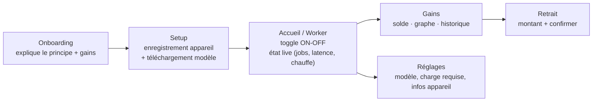

# 04 — App iOS · NVP Node v0

SwiftUI, iOS 17+. Inférence on-device. L’app est le worker.

## Inférence on-device

- **Préféré : MLX Swift** (framework Apple, tourne sur les puces A/M, charge des modèles quantifiés, API Swift native). Repo : `ml-explore/mlx-swift` + `mlx-swift-examples` (qui contient déjà un exemple de chat LLM réutilisable).
- **Alternative : llama.cpp** via un wrapper Swift (GGUF). Plus universel, un peu plus de plomberie.
- **Modèle v0** : un instruct ≤1.5B quantifié 4-bit (ex. Qwen2.5-0.5B/1.5B-Instruct). Téléchargé au premier lancement depuis l’URL donnée par `GET /api/models`, stocké dans `Application Support`, vérifié par checksum.
- **Décodage : greedy (temperature 0, seed fixe)** — imposé par la vérification serveur.

> Contrainte iOS à coder explicitement : le calcul lourd ne tourne pas librement en arrière-plan. Le worker travaille **app au premier plan**. Détecter `scenePhase` et l’état de charge (`UIDevice.batteryState`) ; afficher « actif » seulement si au premier plan, et recommander d’être branché. Throttle si `ProcessInfo.thermalState` est élevé.

## Écrans

### 1. Onboarding

Explique en 2-3 cartes : « ton iPhone exécute de petites IA et tu gagnes des crédits », et la vérité produit : « marche app ouverte, idéalement en charge ». CTA « Commencer ».

### 2. Setup

- Génère une paire de clés (ed25519) → stocke la privée en **Keychain**.
- `POST /workers/register` → reçoit `api_key`, stockée en Keychain.
- `GET /models` → télécharge le modèle (barre de progression, taille affichée), checksum.

### 3. Accueil / Worker (écran principal)

- Gros **toggle « Devenir worker »**.
- Quand ON : boucle long-poll `GET /jobs/next` → exécute → `POST result`.
- Affiche en live : statut (`idle/working`), dernier job, latence moyenne, jobs traités aujourd’hui, crédits gagnés aujourd’hui.
- Bandeau d’état : 🟢 premier plan + branché / 🟡 sur batterie / 🔴 en pause (chauffe ou background).
- Stoppe proprement la boucle quand le toggle passe OFF ou que l’app passe en background.

### 4. Gains

- **Solde** en gros (`GET /me/balance`).
- Petit **graphe** crédits cumulés (les 30 derniers jours / jobs).
- **Historique** (`GET /me/ledger`) : liste des écritures (date, +crédits, job).
- Bouton **« Demander un retrait »** → écran Retrait.

### 5. Retrait

- Champ montant (≤ solde), méthode (manuel v0).
- `POST /payouts` → confirmation, le retrait apparaît en statut `requested`.
- Liste de ses retraits passés (`GET /me/payouts`).

### 6. Réglages

- Modèle actif, espace disque, exiger la charge (on/off), infos appareil, déconnexion.

## Architecture app (suggestion)

- `KeychainStore` : clés + api_key.
- `APIClient` : URLSession async/await, injecte le Bearer, gère le long-poll (timeout > 25 s) et les retries.
- `InferenceEngine` : wrappe MLX, charge le modèle, `generate(prompt, maxTokens) -> String` en greedy.
- `WorkerLoop` : `actor` qui, tant qu’actif et au premier plan, enchaîne next → infer → submit ; respecte thermal/charge.
- `EarningsStore` : solde + ledger, rafraîchi après chaque job accepté et à l’ouverture de l’écran Gains.
- Vues SwiftUI : `OnboardingView`, `SetupView`, `WorkerView`, `EarningsView`, `PayoutView`, `SettingsView`.

## Style visuel

Thème sombre navy + accents or (cohérent avec la marque). Solde mis en valeur, état du worker très lisible d’un coup d’œil.

## Tests sans App Store

Build sur device perso via Xcode (compte développeur). Le **simulateur TS** (voir build plan) valide tout le backend avant même que l’app iOS soit prête.